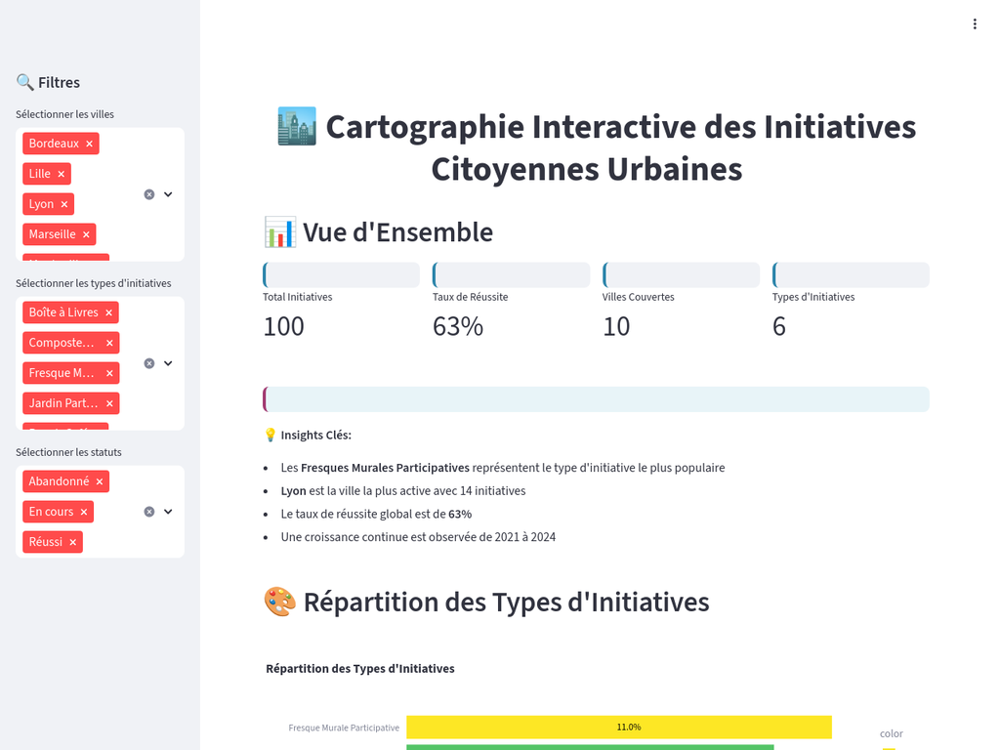

# Cartographie Interactive des Initiatives Citoyennes Urbaines

## 🎯 Description du Projet

Application Streamlit de data visualisation et storytelling analysant les initiatives citoyennes urbaines en France. 

* Compétences en analyse de données, développement web et communication visuelle.

## 🚀 Lancement de l'Application

### Prérequis
- Python 3.11+
- Packages requis : `streamlit`, `plotly`, `folium`, `streamlit-folium`, `pandas`, `numpy`

### Installation
```bash
pip install streamlit plotly folium streamlit-folium pandas numpy
```

### Lancement
```bash
streamlit run app.py
```

L'application sera accessible à l'adresse : `https://cartographie-initiatives-citoyennes.streamlit.app`

## 📊 Fonctionnalités

### Dashboard Principal
- **Métriques clés** : Vue d'ensemble des initiatives
- **Filtres interactifs** : Sélection par ville, type et statut
- **Insights automatiques** : Points clés mis en évidence

### Visualisations Disponibles

1. **Répartition des Types d'Initiatives**
   - Graphique en barres avec pourcentages
   - Tri par ordre décroissant
   - Interprétation contextuelle

2. **Analyse Temporelle**
   - Évolution annuelle (2020-2024)
   - Répartition saisonnière
   - Tendances et patterns

3. **Analyse Géographique**
   - Top 10 des villes actives
   - Top 10 des quartiers dynamiques
   - Identification des clusters

4. **Analyse des Impacts**
   - Corrélation impact social vs environnemental
   - Taux de réussite par type d'initiative
   - Facteurs de succès identifiés

5. **Cartographie Interactive**
   - Géolocalisation précise des initiatives
   - Marqueurs colorés par type
   - Pop-ups informatifs détaillés
   - Légende interactive

## 🎨 Interface Utilisateur

### Design Épuré
- Interface moderne et intuitive
- Couleurs cohérentes et professionnelles
- Navigation fluide et responsive

### Interactivité
- Filtres en temps réel
- Graphiques zoomables et exportables
- Carte interactive avec navigation

## 📈 Données Analysées

### Structure du Dataset
- **100 initiatives** sur 10 villes françaises
- **Période** : 2020-2024
- **6 types d'initiatives** : Fresques, Jardins, Composteurs, Boîtes à Livres, Repair Cafés, Événements
- **Variables d'impact** : Social et environnemental
- **Géolocalisation** : Coordonnées précises

### Insights Principaux
- **63% de taux de réussite** global
- **Fresques murales** : type le plus populaire (22%)
- **Lyon** : ville la plus active (14 initiatives)
- **Croissance continue** de 2021 à 2024

## 🔍 Utilisation des Filtres

### Filtres Disponibles
1. **Villes** : Sélection multiple parmi 10 villes
2. **Types d'initiatives** : Choix parmi 6 catégories
3. **Statuts** : Réussi, En cours, Abandonné

### Mode d'Emploi
1. Utilisez la sidebar gauche pour accéder aux filtres
2. Sélectionnez/désélectionnez les éléments souhaités
3. Les visualisations se mettent à jour automatiquement
4. Utilisez "Clear all" pour réinitialiser un filtre

## 📋 Structure des Fichiers

```
cartographie-initiatives-citoyennes/
├── README.md                    ✅ Ce fichier
├── RAPPORT_ANALYSE.md           ✅ Le rapport complet en Markdown
├── app.py                       ✅ Code principal
├── analyze_data.py              ✅ Script d'analyse
├── data_fictives_augmentees.csv ✅ Données
├── requirements.txt             ✅ Dépendances
└── images/                      ✅ Capture d'écran du dashboard
    └── dashboard-preview.png    
```

## 🎓 Compétences Démontrées

### Techniques
- **Python** : Pandas, Plotly, Streamlit
- **Data Visualisation** : Graphiques interactifs, cartographie
- **Développement Web** : Interface utilisateur

### Analytiques
- **Analyse exploratoire** de données
- **Identification de patterns** et tendances
- **Storytelling** avec les données

### Communication
- **Rapport structuré** avec interprétations
- **Interface intuitive** pour non-experts
- **Insights actionnables** pour décideurs

## 🎯 Cas d'Usage

### Pour les Collectivités
- Pilotage des politiques de soutien aux initiatives citoyennes
- Identification des territoires à fort potentiel
- Optimisation des ressources d'accompagnement

### Pour les Chercheurs
- Analyse des dynamiques d'engagement citoyen
- Étude des facteurs de réussite des projets participatifs
- Recherche en sociologie urbaine

### Pour les Porteurs de Projets
- Benchmark des initiatives similaires
- Identification des meilleures pratiques
- Choix du timing et de la localisation optimaux

## 📊 Analyse Complète

Ce projet constitue un **proof of concept** démontrant des compétences en data visualisation et storytelling. 

👉 **[Consultez le rapport d'analyse complet](rapport_initiatives_citoyennes.md)** pour :
- Méthodologie détaillée d'obtention des données
- Interprétation approfondie de chaque visualisation
- Insights stratégiques et recommandations
- Exploration détaillée

---

## Auteur  Nathan ZOUHOU

**Projet réalisé avec** : Python, Streamlit, Plotly, Folium  
**Objectif** : Démonstration de compétences en Data Science et Visualisation  
**Statut** : Données fictives


#### Aperçu de l'application



