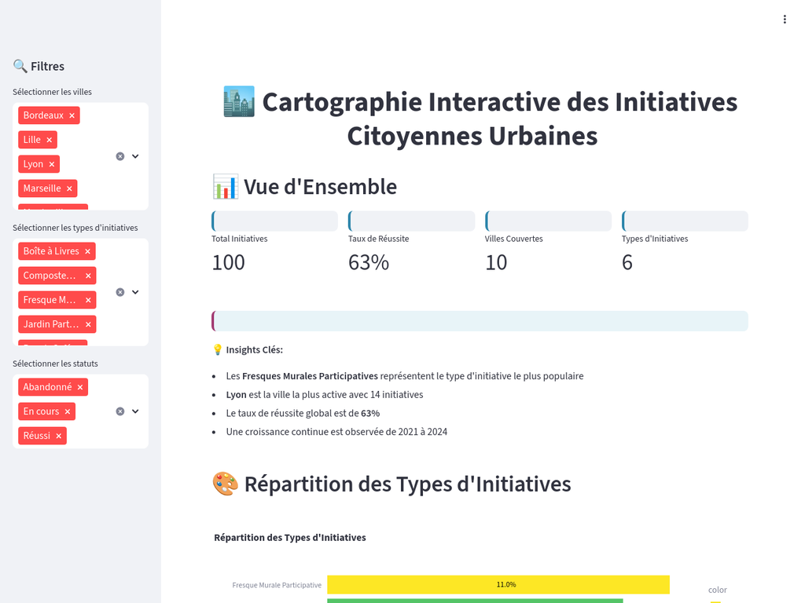

# Cartographie Interactive des Initiatives Citoyennes Urbaines

## 🎯 Description du Projet

Une application simple pour découvrir 100 projets citoyens dans 10 villes françaises

## 🎯 Qu'est-ce que c'est ?

Cette application montre des **projets que les habitants organisent eux-mêmes** dans leur quartier :
- 🎨 **Fresques murales** peintes ensemble
- 🌱 **Jardins partagés** pour cultiver des légumes
- 🔧 **Repair Cafés** pour réparer au lieu de jeter
- 📚 **Boîtes à livres** pour partager la lecture
- 🗑️ **Composteurs** pour recycler les déchets
- 🎉 **Événements de quartier** pour se rencontrer

## 🚀 Voir l'Application



👉 L'application sera accessible à l'adresse : [Ouvrir l’application Streamlit](https://cartographie-initiatives-citoyennes.streamlit.app)

## 📊 Ce que vous découvrirez
```bash
### **4 Chiffres Importants**
- 100 projets recensés
- 63% de taux de réussite
- 10 villes françaises
- 6 types de projets différents

### 🔍 Mode d'Emploi ?

1. **Regardez les 4 chiffres** en haut pour comprendre l'ensemble
2. **Utilisez les filtres** à gauche pour accéder aux filtres
3. **Explorez les graphiques** pour voir les tendances
4. **Cliquez sur la carte** pour découvrir les projets près de chez vous
```

## 💻 Pour les Curieux - Comment ça marche ?
```bash
# Installer les outils nécessaires
- Python 3.11+
- Packages requis : `streamlit`, `plotly`, `folium`, `streamlit-folium`, `pandas`, `numpy`

# Lancement
```bash
streamlit run app.py
```

## 📋 Fichiers du Projet
```
cartographie-initiatives-citoyennes/
├── README.md                    ✅ Ce fichier
├── rapport_analyse.md           ✅ Le rapport complet en Markdown
├── app.py                       ✅ Code principal            
├── data_fictives_augmentees.csv ✅ Données
├── requirements.txt             ✅ Dépendances
├── gitignore  
└── images/                      ✅ Capture d'écran du dashboard
    └── dashboard-preview.png    
```

## 🎓 Pourquoi ce Projet ?

### **Objectif Simple**
Montrer que la **data visualisation** peut être **accessible à tous** - pas besoin d'être expert pour comprendre des données !

### **Compétences Démontrées**
- ✅ **Analyser des données** (100 projets, 19 variables)
- ✅ **Créer des graphiques** clairs et beaux
- ✅ **Développer une app web** interactive
- ✅ **Raconter une histoire** avec les chiffres

#### 📈 Données Analysées
```bash
- **100 initiatives** sur 10 villes françaises
- **Période** : 2020-2024
- **6 types d'initiatives** : Fresques, Jardins, Composteurs, Boîtes à Livres, Repair Cafés, Événements
- **Variables d'impact** : Social et environnemental
- **Géolocalisation** : Coordonnées précises
```

## 🌟 Les Découvertes Principales

### **🎨 L'Art Motive le Plus**
Les fresques murales représentent 22% des projets - l'expression créative rassemble !

### **📈 Tendance Positive**
+44% de projets entre 2021 et 2024 - les citoyens s'engagent de plus en plus !

### **🏆 Lyon Champion**
Lyon est la ville la plus active avec 14 projets sur 100.

### **✅ Ça Marche !**
63% des projets réussissent - preuve que l'engagement citoyen porte ses fruits !


## 🎯 Cas d'Usage
```bash
# **Utilisation Possible**
- **Mairies** : Identifier où soutenir les initiatives
- **Associations** : Trouver des partenaires locaux  
- **Citoyens** : Découvrir des projets à rejoindre
- **Étudiants** : Apprendre la data visualisation
```

## 📊 Analyse Complète

👉 **[Consultez le rapport d'analyse complet](rapport_analyse.md)** pour :
- Méthodologie et exploration détaillée
- Interprétation approfondie de chaque visualisation
- Insights stratégiques et recommandations
- Exploration détaillée

---

## 👤 Auteur 

 **Nathan ZOUHOU**  GitHub: [@InsedayZ](https://github.com/InsedayZ)

**Statut** : Données fictives

## 🤝 Aide et contribution

- 🐛 **Un bug ?** Ouvrez une "Issue"
- 💡 **Une idée ?** Proposez une amélioration
- ⭐ **Ça vous plaît ?** Mettez une étoile !